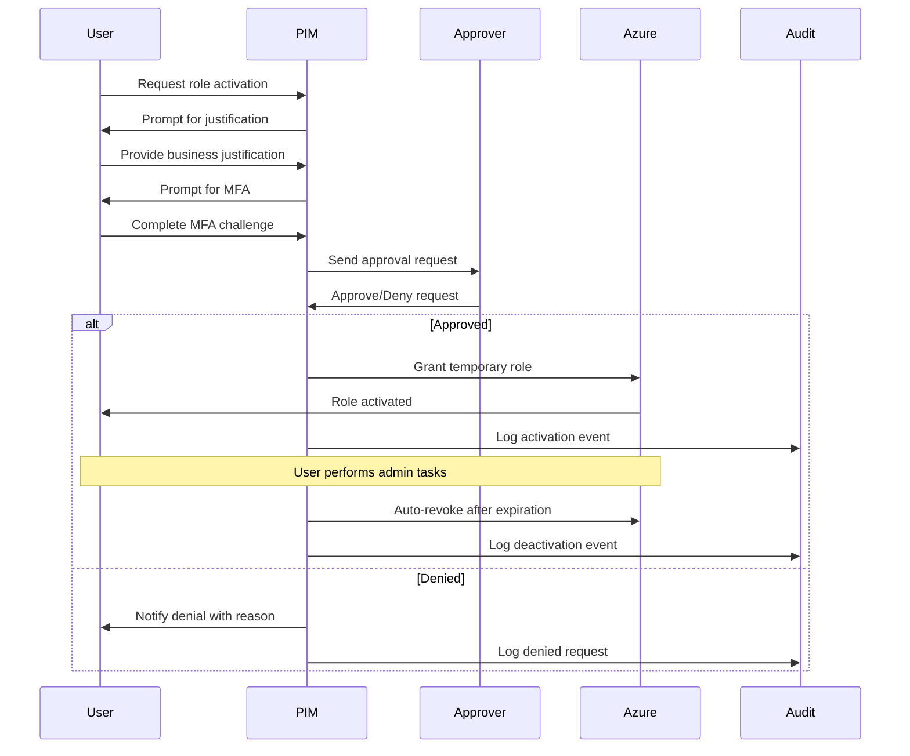

# Zero-Trust Admin Access Guide

**Document Version:** 1.0  
**Last Updated:** November 23, 2025  
**Owner:** Cloud Health Office Security Team

---

## Table of Contents

- [Overview](#overview)
- [Zero-Trust Principles](#zero-trust-principles)
- [Just-in-Time (JIT) Admin Access](#just-in-time-jit-admin-access)
- [Azure AD Privileged Identity Management (PIM)](#azure-ad-privileged-identity-management-pim)
- [Break-Glass Emergency Access](#break-glass-emergency-access)
- [Access Request Workflow](#access-request-workflow)
- [Monitoring and Auditing](#monitoring-and-auditing)
- [Implementation Guide](#implementation-guide)

---

## Overview

Cloud Health Office implements a zero-trust security model for administrative access, ensuring that no user has standing privileged access to production systems. All administrative operations require just-in-time (JIT) activation with approval workflows and comprehensive audit logging.

### Zero-Trust Philosophy

**Core Principle:** Never trust, always verify.

**Implementation:**
- No permanent administrative access
- Time-bound privilege elevation
- Multi-factor authentication required
- Approval workflow for sensitive operations
- Comprehensive audit logging
- Principle of least privilege enforced

### Security Benefits

| Traditional Access Model | Zero-Trust JIT Access |
|-------------------------|----------------------|
| ❌ Permanent admin rights | ✅ Temporary elevation only |
| ❌ No expiration | ✅ Time-limited (max 8 hours) |
| ❌ Self-activation | ✅ Approval required |
| ❌ Shared accounts | ✅ Individual identity tracking |
| ❌ No audit trail | ✅ Complete audit logging |
| ❌ High attack surface | ✅ Minimal attack window |

---

## Zero-Trust Principles

### 1. Verify Explicitly

**Implementation:**
- Azure AD authentication with MFA required
- Conditional Access policies enforce device compliance
- Risk-based authentication evaluates sign-in context
- Continuous access evaluation (CAE) monitors session security

**Configuration:**
```bash
# Verify MFA enforcement
az ad conditional-access policy show \
  --id "{mfa-policy-id}" \
  --query "{state:state, grantControls:grantControls}"

# Output:
# {
#   "state": "enabled",
#   "grantControls": {
#     "builtInControls": ["mfa"],
#     "operator": "OR"
#   }
# }
```

### 2. Use Least Privilege Access

**Implementation:**
- RBAC roles assigned at resource group or resource level (not subscription)
- Custom roles for specific operations
- No wildcard permissions
- Regular access reviews to remove unused permissions

**RBAC Role Hierarchy:**

```
Subscription (Owner/Contributor - AVOID)
├── Resource Group (Reader for visibility)
│   ├── Storage Account (Storage Blob Data Contributor - JIT only)
│   ├── Service Bus (Service Bus Data Sender - JIT only)
│   ├── Key Vault (Key Vault Secrets Officer - JIT only)
│   └── Logic App (Logic App Contributor - JIT only)
```

**Example Assignment:**
```bash
# Assign least-privilege role at resource level
az role assignment create \
  --assignee "{user-or-group-id}" \
  --role "Storage Blob Data Contributor" \
  --scope "/subscriptions/{sub}/resourceGroups/{rg}/providers/Microsoft.Storage/storageAccounts/{storage}"
```

### 3. Assume Breach

**Implementation:**
- Private endpoints eliminate public internet exposure
- Network segmentation via VNet integration
- Data encryption in transit and at rest
- Immutable audit logs
- Automated threat detection

**Defense-in-Depth Layers:**

1. **Identity** - Azure AD with MFA
2. **Network** - Private endpoints, NSG rules
3. **Compute** - Logic Apps with managed identity
4. **Application** - Input validation, output encoding
5. **Data** - Encryption (AES-256), access controls
6. **Monitoring** - Application Insights, Azure Monitor

---

## Just-in-Time (JIT) Admin Access

### Overview

JIT access provides temporary elevation to administrative roles only when needed, with automatic expiration and audit logging.

### Key Features

| Feature | Description | Benefit |
|---------|-------------|---------|
| **Time-Limited** | Maximum 8-hour activation | Minimizes exposure window |
| **Approval Required** | Manager or security team approval | Prevents unauthorized elevation |
| **MFA Enforcement** | Additional authentication at activation | Prevents credential compromise |
| **Activity Logging** | All actions logged during elevated session | Complete audit trail |
| **Auto-Expiration** | Privileges automatically revoked | No manual de-provisioning needed |

### Supported Roles for JIT Access

#### Azure Resource Roles

| Role | Activation Time | Approval Required | Use Case |
|------|----------------|-------------------|----------|
| **Owner** | 4 hours | Yes | Emergency infrastructure changes |
| **Contributor** | 4 hours | Yes | Resource configuration updates |
| **User Access Administrator** | 2 hours | Yes | RBAC assignment changes |
| **Storage Blob Data Contributor** | 8 hours | No | Blob storage operations |
| **Service Bus Data Sender** | 8 hours | No | Service Bus message operations |
| **Key Vault Secrets Officer** | 4 hours | Yes | Secret management |

#### Azure AD Roles

| Role | Activation Time | Approval Required | Use Case |
|------|----------------|-------------------|----------|
| **Global Administrator** | 2 hours | Yes | Critical AD changes only |
| **Security Administrator** | 4 hours | Yes | Security policy changes |
| **Conditional Access Administrator** | 4 hours | Yes | Access policy modifications |
| **Application Administrator** | 4 hours | No | App registration management |

### JIT Activation Process



### Example JIT Workflow

**Scenario:** DevOps engineer needs to update Logic App workflow configuration.

**Steps:**

1. **Request Activation:**
   ```bash
   # Via Azure Portal: PIM → My Roles → Activate
   # Via PowerShell:
   $roleDefinitionId = Get-AzRoleDefinition -Name "Logic App Contributor" | Select-Object -ExpandProperty Id
   New-AzRoleEligibilityScheduleRequest \
     -Name (New-Guid).Guid \
     -Scope "/subscriptions/{sub}/resourceGroups/{rg}" \
     -RoleDefinitionId $roleDefinitionId \
     -PrincipalId "{user-object-id}" \
     -RequestType "SelfActivate" \
     -ScheduleInfo @{
       StartDateTime = Get-Date
       Expiration = @{
         Type = "AfterDuration"
         Duration = "PT8H"  # 8 hours
       }
     } \
     -Justification "Deploying workflow updates for 275 ingestion - Ticket #12345"
   ```

2. **MFA Challenge:**
   - User completes MFA authentication
   - Conditional Access policy validates device compliance

3. **Approval (if required):**
   - Approval request sent to designated approver(s)
   - Approver reviews justification and ticket reference
   - Approver approves or denies via Azure Portal or mobile app

4. **Activation Confirmation:**
   - User receives notification of activation
   - Role assignment visible in Azure Portal
   - User can now perform authorized operations

5. **Perform Administrative Tasks:**
   - Update Logic App workflow
   - All actions logged to Activity Log
   - Application Insights captures detailed operations

6. **Automatic Expiration:**
   - Role automatically revoked after 8 hours
   - User receives expiration notification
   - Deactivation logged to audit trail

---

## Azure AD Privileged Identity Management (PIM)

### Overview

Azure AD PIM provides comprehensive JIT access management for Azure resources and Azure AD roles, with approval workflows, audit logging, and access reviews.

### Prerequisites

**Licensing:**
- Azure AD Premium P2 license required
- Available via Microsoft 365 E5 or standalone purchase

**Permissions:**
- Privileged Role Administrator (to configure PIM)
- Global Administrator (to enable PIM initially)

### PIM Configuration

#### 1. Enable PIM for Azure Resources

```bash
# Enable PIM for subscription or resource group
az ad privileged-identity-management resource enable \
  --resource-id "/subscriptions/{subscription-id}" \
  --resource-type "subscription"

# Verify PIM enabled
az ad privileged-identity-management resource show \
  --resource-id "/subscriptions/{subscription-id}" \
  --resource-type "subscription"
```

#### 2. Configure Role Settings

**Global Settings:**
- Maximum activation duration: 8 hours (configurable per role)
- Require approval: Yes (for privileged roles)
- Require MFA: Yes (all roles)
- Require justification: Yes (all roles)
- Require ticket system reference: Optional

**Per-Role Settings Example:**

```json
{
  "roleDefinitionId": "/subscriptions/{sub}/providers/Microsoft.Authorization/roleDefinitions/{role-id}",
  "isEligibleRole": true,
  "enablementRules": [
    "MultiFactorAuthentication",  // MFA required at activation
    "Justification"                 // Business reason required
  ],
  "activationRules": {
    "maximumDuration": "PT8H",      // 8 hours
    "requireApproval": true,
    "approvers": [
      {
        "id": "{approver-user-id}",
        "displayName": "Security Manager"
      },
      {
        "id": "{approver-group-id}",
        "displayName": "Security Team"
      }
    ]
  },
  "notificationRules": {
    "activationAlerts": [
      {
        "recipients": ["security-team@example.com"],
        "notificationLevel": "All"
      }
    ]
  }
}
```

#### 3. Assign Eligible Roles

**Replace permanent role assignments with eligible assignments:**

```bash
# Remove permanent assignment
az role assignment delete \
  --assignee "{user-id}" \
  --role "Contributor" \
  --scope "/subscriptions/{sub}/resourceGroups/{rg}"

# Create eligible assignment (via PIM)
$scheduleInfo = @{
  StartDateTime = Get-Date
  Expiration = @{
    Type = "NoExpiration"  # Eligible assignment doesn't expire (activation does)
  }
}

New-AzRoleEligibilityScheduleRequest \
  -Name (New-Guid).Guid \
  -Scope "/subscriptions/{sub}/resourceGroups/{rg}" \
  -RoleDefinitionId "/subscriptions/{sub}/providers/Microsoft.Authorization/roleDefinitions/{contributor-role-id}" \
  -PrincipalId "{user-id}" \
  -RequestType "AdminAssign" \
  -ScheduleInfo $scheduleInfo \
  -Justification "JIT access for production support - approved by security team"
```

#### 4. Configure Approval Workflow

**Single-Stage Approval:**
- One approver required
- Any approver can approve/deny
- Timeout: 24 hours (auto-deny)

**Multi-Stage Approval:**
- Multiple approvers required in sequence
- First approver (manager), then second approver (security team)
- Timeout per stage: 8 hours

**Configuration:**

```powershell
# Configure approval settings
$approvalSettings = @{
  IsApprovalRequired = $true
  IsApprovalRequiredForExtension = $false
  ApprovalStages = @(
    @{
      ApprovalStageTimeOutInDays = 1
      IsApproverJustificationRequired = $true
      PrimaryApprovers = @(
        @{ Id = "{manager-group-id}"; Type = "Group" }
      )
    }
  )
}

Set-AzureADMSPrivilegedRoleSetting \
  -ProviderId "aadRoles" \
  -Id "{role-setting-id}" \
  -RoleDefinitionId "{role-id}" \
  -ApprovalSettings $approvalSettings
```

### PIM Access Reviews

**Purpose:** Regularly validate that eligible role assignments are still necessary.

**Configuration:**

```powershell
# Create quarterly access review
$reviewers = @(
  @{ Id = "{manager-id}"; Type = "User" },
  @{ Id = "{security-team-group-id}"; Type = "Group" }
)

New-AzureADMSAccessReview \
  -DisplayName "Cloud Health Office Admin Access Review - Q4 2025" \
  -StartDateTime "2025-10-01T00:00:00Z" \
  -EndDateTime "2025-10-31T23:59:59Z" \
  -ReviewerType "Reviewers" \
  -Reviewers $reviewers \
  -Scope @{
    Type = "AzureRole"
    RoleDefinitionId = "{contributor-role-id}"
    ResourceId = "/subscriptions/{sub}/resourceGroups/{rg}"
  } \
  -Settings @{
    RecurrenceSettings = @{
      RecurrenceType = "Quarterly"
      RecurrenceStartDateTime = "2025-10-01T00:00:00Z"
    }
    RecommendationsEnabled = $true
    AutoApplyDecisionsEnabled = $true
  }
```

**Review Process:**

1. **Notification:** Reviewers receive email notification
2. **Review:** Assess each user's need for eligible role
3. **Decision:** Approve (retain access) or Deny (remove access)
4. **Auto-Apply:** Decisions automatically implemented (optional)
5. **Reporting:** Review results logged for audit

---

## Break-Glass Emergency Access

### Overview

Break-glass accounts provide emergency access when normal authentication methods fail (e.g., Azure AD outage, MFA system failure, mass account lockout).

### Break-Glass Account Requirements

**Characteristics:**
- Excluded from all Conditional Access policies (no MFA)
- Cloud-only accounts (not synced from on-premises)
- Global Administrator role (permanent)
- Unique, complex passwords (>20 characters)
- Stored in physical safe (offline backup)
- Monitored continuously for unauthorized use

### Configuration

#### 1. Create Break-Glass Accounts

**Recommendation:** Create two break-glass accounts for redundancy.

```bash
# Create first break-glass account
az ad user create \
  --display-name "Break-Glass Account 1" \
  --user-principal-name "breakglass1@yourtenant.onmicrosoft.com" \
  --password "{very-strong-password-20+-chars}" \
  --force-change-password-next-sign-in false \
  --account-enabled true

# Assign Global Administrator role
az ad role assignment create \
  --role "Global Administrator" \
  --assignee "breakglass1@yourtenant.onmicrosoft.com"

# Repeat for second account
az ad user create \
  --display-name "Break-Glass Account 2" \
  --user-principal-name "breakglass2@yourtenant.onmicrosoft.com" \
  --password "{different-very-strong-password}" \
  --force-change-password-next-sign-in false \
  --account-enabled true

az ad role assignment create \
  --role "Global Administrator" \
  --assignee "breakglass2@yourtenant.onmicrosoft.com"
```

#### 2. Exclude from Conditional Access

**Create exclusion group:**

```bash
# Create Azure AD group for break-glass accounts
az ad group create \
  --display-name "Break-Glass Accounts Exclusion" \
  --mail-nickname "breakglass-exclusion" \
  --description "Accounts excluded from Conditional Access policies for emergency access"

# Add break-glass accounts to group
az ad group member add \
  --group "Break-Glass Accounts Exclusion" \
  --member-id "{breakglass1-object-id}"

az ad group member add \
  --group "Break-Glass Accounts Exclusion" \
  --member-id "{breakglass2-object-id}"
```

**Update Conditional Access policies to exclude group:**

```bash
# For each Conditional Access policy:
az ad conditional-access policy update \
  --id "{policy-id}" \
  --conditions @conditions.json

# conditions.json:
{
  "users": {
    "includeUsers": ["All"],
    "excludeGroups": ["{breakglass-exclusion-group-id}"]
  }
}
```

#### 3. Configure Monitoring and Alerts

**Alert on break-glass account usage:**

```bash
# Create alert rule for break-glass sign-in
az monitor scheduled-query create \
  --name "break-glass-account-usage" \
  --resource-group "{monitoring-rg}" \
  --scopes "/subscriptions/{sub}/resourceGroups/{rg}" \
  --condition "count > 0" \
  --condition-query "SigninLogs | where UserPrincipalName startswith 'breakglass' | where TimeGenerated > ago(5m) | summarize count()" \
  --description "Alert when break-glass accounts are used" \
  --evaluation-frequency 5m \
  --window-size 5m \
  --severity 0 \
  --action-groups "/subscriptions/{sub}/resourceGroups/{rg}/providers/Microsoft.Insights/actionGroups/{action-group}"
```

**Action group notifies:**
- Security team (email, SMS)
- CISO (email, phone call)
- SOC team (integration with incident management)

### Break-Glass Usage Procedure

**When to Use:**
1. Azure AD service outage preventing normal sign-in
2. MFA system failure (e.g., SMS gateway down)
3. Mass account lockout due to security incident
4. Conditional Access policy misconfiguration blocking all access
5. Emergency security response requiring immediate action

**Usage Steps:**

1. **Retrieve Credentials:**
   - Access physical safe containing break-glass credentials
   - Retrieve password for breakglass1 account
   - Document retrieval in physical log

2. **Sign In:**
   ```bash
   # Sign in with break-glass account (no MFA required)
   az login --username breakglass1@yourtenant.onmicrosoft.com --password "{password}"
   ```

3. **Perform Emergency Actions:**
   - Fix Conditional Access policy
   - Unlock user accounts
   - Restore service
   - Document all actions taken

4. **Post-Incident Actions:**
   - Immediately rotate break-glass passwords
   - Document incident and actions in incident log
   - Conduct post-incident review
   - Update procedures if needed

5. **Audit and Reporting:**
   ```kusto
   // Query break-glass account activity
   SigninLogs
   | where UserPrincipalName startswith "breakglass"
   | where TimeGenerated > ago(30d)
   | project TimeGenerated, UserPrincipalName, IPAddress, Location, ResultType
   | order by TimeGenerated desc
   ```

### Testing Break-Glass Access

**Quarterly Test Procedure:**

1. **Schedule Test:** Notify security team 24 hours in advance
2. **Retrieve Credentials:** Access physical safe
3. **Attempt Sign-In:** Verify break-glass account can authenticate
4. **Verify Permissions:** Confirm Global Administrator role active
5. **Test Critical Operations:** 
   - View Azure resources
   - Access Key Vault (read-only test)
   - View Conditional Access policies (no changes)
6. **Sign Out:** Immediately terminate session
7. **Document Test:** Record test results, any issues encountered
8. **Rotate Password:** Change break-glass password after test
9. **Update Safe:** Store new password in physical safe
10. **Review Alerts:** Verify monitoring alerts triggered correctly

---

## Access Request Workflow

### Standard Access Request Process

#### 1. Request Submission

**Information Required:**
- Requestor name and email
- Azure AD account
- Requested role(s)
- Scope (subscription, resource group, resource)
- Business justification
- Duration needed
- Ticket/work order reference
- Manager approval (pre-approval)

**Request Form:**

```markdown
## Access Request

**Requestor:** John Doe (john.doe@example.com)
**Azure AD Account:** john.doe@yourtenant.onmicrosoft.com
**Requested Role:** Storage Blob Data Contributor
**Scope:** /subscriptions/{sub}/resourceGroups/payer-attachments-prod-rg/providers/Microsoft.Storage/storageAccounts/hipaa-storage-prod
**Justification:** Need to investigate and remediate blob storage performance issue reported in ticket INC-12345
**Duration:** 4 hours
**Ticket Reference:** INC-12345
**Manager Approval:** Jane Smith (approved via email 2025-11-23 10:00 AM)
```

#### 2. Security Review

**Validation:**
- [ ] Requestor identity verified
- [ ] Justification aligns with job responsibilities
- [ ] Scope follows least-privilege principle
- [ ] Duration is reasonable
- [ ] Manager approval confirmed
- [ ] No security concerns (e.g., recent failed sign-ins, suspicious activity)

**Approval Criteria:**
- ✅ Read-only roles: Auto-approved for eligible users
- ✅ Contributor roles: Manager approval required
- ✅ Owner/Administrator roles: Security team + manager approval required

#### 3. Role Assignment (Eligible)

```bash
# Assign eligible role via PIM
$scheduleInfo = @{
  StartDateTime = Get-Date
  Expiration = @{
    Type = "NoExpiration"  # Eligible assignment (user activates when needed)
  }
}

New-AzRoleEligibilityScheduleRequest \
  -Name (New-Guid).Guid \
  -Scope "/subscriptions/{sub}/resourceGroups/{rg}/providers/Microsoft.Storage/storageAccounts/{storage}" \
  -RoleDefinitionId "/subscriptions/{sub}/providers/Microsoft.Authorization/roleDefinitions/{role-id}" \
  -PrincipalId "{user-object-id}" \
  -RequestType "AdminAssign" \
  -ScheduleInfo $scheduleInfo \
  -Justification "Access request INC-12345 approved by manager and security team"

# Notify requestor
Send-MailMessage \
  -To "john.doe@example.com" \
  -Subject "Access Request Approved - INC-12345" \
  -Body "Your request for Storage Blob Data Contributor access has been approved. You can now activate this role via Azure PIM when needed."
```

#### 4. Activation by User

**User activates role when needed:**

1. Navigate to Azure Portal → Privileged Identity Management → My Roles
2. Select eligible role
3. Click "Activate"
4. Provide justification and ticket reference
5. Complete MFA challenge
6. Wait for approval (if required)
7. Use activated role for authorized operations
8. Role auto-expires after configured duration

#### 5. Post-Use Review

**Weekly access review:**
- Review all role activations from previous week
- Validate justifications match documented reasons
- Identify any unusual patterns or excessive activations
- Document findings in access log

---

## Monitoring and Auditing

### Real-Time Monitoring

#### Azure Monitor Alerts

**Alert on privileged role activation:**

```kusto
// Query for privileged role activations
AuditLogs
| where TimeGenerated > ago(5m)
| where OperationName == "Add eligible member to role completed (PIM activation)"
| where Result == "success"
| extend RoleName = tostring(parse_json(TargetResources)[0].displayName)
| extend UserPrincipalName = tostring(parse_json(InitiatedBy).user.userPrincipalName)
| project TimeGenerated, UserPrincipalName, RoleName, OperationName
```

**Create alert:**

```bash
az monitor scheduled-query create \
  --name "privileged-role-activation" \
  --resource-group "{monitoring-rg}" \
  --scopes "/subscriptions/{sub}" \
  --condition "count > 0" \
  --condition-query "AuditLogs | where TimeGenerated > ago(5m) | where OperationName == 'Add eligible member to role completed (PIM activation)' | where Result == 'success' | summarize count()" \
  --description "Alert when users activate privileged roles" \
  --evaluation-frequency 5m \
  --window-size 5m \
  --severity 2 \
  --action-groups "/subscriptions/{sub}/resourceGroups/{rg}/providers/Microsoft.Insights/actionGroups/{action-group}"
```

**Alert on break-glass account usage:**

```bash
az monitor scheduled-query create \
  --name "break-glass-account-usage" \
  --resource-group "{monitoring-rg}" \
  --scopes "/subscriptions/{sub}" \
  --condition "count > 0" \
  --condition-query "SigninLogs | where UserPrincipalName startswith 'breakglass' | where TimeGenerated > ago(5m) | summarize count()" \
  --description "CRITICAL: Break-glass emergency account used" \
  --evaluation-frequency 5m \
  --window-size 5m \
  --severity 0 \
  --action-groups "/subscriptions/{sub}/resourceGroups/{rg}/providers/Microsoft.Insights/actionGroups/{critical-action-group}"
```

### Audit Logging

#### Role Activation Audit

```kusto
// Comprehensive role activation audit
AuditLogs
| where TimeGenerated > ago(30d)
| where OperationName contains "PIM"
| extend UserPrincipalName = tostring(parse_json(InitiatedBy).user.userPrincipalName)
| extend RoleName = tostring(parse_json(TargetResources)[0].displayName)
| extend Justification = tostring(parse_json(TargetResources)[0].modifiedProperties[0].newValue)
| project TimeGenerated, UserPrincipalName, RoleName, OperationName, Justification, Result
| order by TimeGenerated desc
```

#### Break-Glass Account Audit

```kusto
// Break-glass account activity audit
SigninLogs
| where UserPrincipalName startswith "breakglass"
| project TimeGenerated, UserPrincipalName, IPAddress, Location, ResultType, RiskLevelDuringSignIn
| order by TimeGenerated desc
```

#### Failed Activation Attempts

```kusto
// Failed role activation attempts (potential unauthorized access)
AuditLogs
| where TimeGenerated > ago(30d)
| where OperationName contains "PIM"
| where Result == "failure"
| extend UserPrincipalName = tostring(parse_json(InitiatedBy).user.userPrincipalName)
| extend RoleName = tostring(parse_json(TargetResources)[0].displayName)
| extend FailureReason = tostring(ResultReason)
| project TimeGenerated, UserPrincipalName, RoleName, OperationName, FailureReason
| order by TimeGenerated desc
```

### Reporting

#### Monthly Access Report

**Report Contents:**
- Total number of role activations
- Top 10 users by activation count
- Average activation duration
- Approval/denial statistics
- Failed activation attempts
- Break-glass account usage (should be 0)
- Access review completion status

**Generate Report:**

```powershell
# PowerShell script to generate monthly access report
$startDate = (Get-Date).AddDays(-30)
$endDate = Get-Date

# Get all role activations
$activations = Get-AzureADAuditSignInLogs -Filter "activityDateTime ge $($startDate.ToString('yyyy-MM-dd')) and activityDateTime le $($endDate.ToString('yyyy-MM-dd'))"

# Analyze and generate report
$report = @{
  TotalActivations = ($activations | Measure-Object).Count
  TopUsers = $activations | Group-Object UserPrincipalName | Sort-Object Count -Descending | Select-Object -First 10
  AverageDuration = ($activations | Measure-Object -Property DurationMinutes -Average).Average
  ApprovalStats = $activations | Group-Object ApprovalStatus | Select-Object Name, Count
}

# Export to JSON
$report | ConvertTo-Json -Depth 3 | Out-File "monthly-access-report-$(Get-Date -Format 'yyyy-MM').json"
```

---

## Implementation Guide

### Phase 1: Preparation (Week 1)

**Tasks:**

1. **Review Current Access:**
   ```bash
   # Export current role assignments
   az role assignment list --all --output json > current-role-assignments.json
   
   # Identify users with permanent privileged roles
   az role assignment list --all --query "[?roleDefinitionName=='Owner' || roleDefinitionName=='Contributor']" --output table
   ```

2. **Plan Role Mappings:**
   - Map permanent roles to eligible roles
   - Define activation durations per role
   - Identify approvers for each role
   - Create approval workflow design

3. **Create Documentation:**
   - Access request form template
   - User guide for PIM activation
   - Approver guide
   - Break-glass procedures

4. **Stakeholder Communication:**
   - Notify all users with current admin access
   - Schedule training sessions
   - Provide timeline for transition
   - Answer questions and concerns

### Phase 2: PIM Configuration (Week 2)

**Tasks:**

1. **Enable PIM:**
   ```bash
   # Enable PIM for subscription
   az ad privileged-identity-management resource enable \
     --resource-id "/subscriptions/{subscription-id}" \
     --resource-type "subscription"
   ```

2. **Configure Role Settings:**
   - Set activation durations (4-8 hours)
   - Enable MFA requirement
   - Enable justification requirement
   - Configure approval workflows
   - Set up notification rules

3. **Create Break-Glass Accounts:**
   - Create two break-glass accounts
   - Assign Global Administrator role
   - Exclude from Conditional Access
   - Store credentials in physical safe
   - Configure monitoring alerts

4. **Test Configuration:**
   - Test role activation process
   - Test approval workflow
   - Test break-glass account access
   - Verify monitoring alerts work

### Phase 3: Migration (Week 3)

**Tasks:**

1. **Convert Role Assignments:**
   ```powershell
   # For each user with permanent role:
   
   # 1. Create eligible assignment
   New-AzRoleEligibilityScheduleRequest `
     -Name (New-Guid).Guid `
     -Scope "/subscriptions/{sub}/resourceGroups/{rg}" `
     -RoleDefinitionId "{role-id}" `
     -PrincipalId "{user-id}" `
     -RequestType "AdminAssign" `
     -ScheduleInfo @{ StartDateTime = Get-Date; Expiration = @{ Type = "NoExpiration" } } `
     -Justification "Migration to JIT access model"
   # 3. Notify user of change
   Send-MailMessage -To "{user-email}" -Subject "Admin Access Migrated to JIT Model" -Body "..."
   ```

2. **Pilot Group:**
   - Select 5-10 users for pilot
   - Migrate pilot group first
   - Monitor for issues
   - Gather feedback
   - Adjust configuration as needed

3. **Full Migration:**
   - Migrate remaining users in batches
   - Monitor closely for first 48 hours
   - Provide support for activation issues
   - Document lessons learned

### Phase 4: Validation (Week 4)

**Tasks:**

1. **Verify Migration Complete:**
   ```bash
   # Verify no remaining permanent privileged assignments
   az role assignment list --all --query "[?roleDefinitionName=='Owner' || roleDefinitionName=='Contributor']" --output table
   # Should return only service accounts and excluded accounts
   ```

2. **Test All Roles:**
   - Each user activates their eligible roles
   - Verify activation succeeds
   - Verify approval workflow works
   - Verify role expires correctly

3. **Test Break-Glass:**
   - Test break-glass account sign-in
   - Verify alerts triggered
   - Verify permissions work
   - Rotate passwords after test

4. **Documentation Update:**
   - Update access request procedures
   - Update runbooks with PIM instructions
   - Create user FAQ
   - Update incident response procedures

### Phase 5: Ongoing Operations

**Monthly Tasks:**
- Review role activation logs
- Generate access report
- Identify any unauthorized attempts
- Conduct user access reviews

**Quarterly Tasks:**
- Test break-glass accounts
- Review and update role settings
- Conduct PIM training for new users
- Update documentation

**Annually:**
- Full audit of PIM configuration
- Review and update access policies
- Conduct tabletop exercise for break-glass scenario
- Management attestation of zero-trust compliance

---

## Success Metrics

### Key Performance Indicators

| Metric | Target | Measurement |
|--------|--------|-------------|
| **No Permanent Admin Access** | 0 permanent assignments | Monthly audit |
| **Average Activation Time** | <5 minutes | PIM logs |
| **Approval Response Time** | <2 hours | PIM logs |
| **Failed Activations** | <5% of total | PIM logs |
| **Break-Glass Usage** | 0 (except tests) | Sign-in logs |
| **Access Review Completion** | 100% | PIM access review reports |

### Compliance Validation

**Monthly Checklist:**
- [ ] No permanent privileged role assignments
- [ ] All activations have documented justification
- [ ] All approvals processed within SLA
- [ ] Break-glass accounts not used (except scheduled tests)
- [ ] Monitoring alerts functioning correctly

**Quarterly Checklist:**
- [ ] Access reviews completed
- [ ] Break-glass accounts tested
- [ ] Role settings reviewed and updated if needed
- [ ] User training conducted for new team members
- [ ] Documentation updated

---

## References

### Microsoft Documentation
- [Azure AD Privileged Identity Management](https://docs.microsoft.com/en-us/azure/active-directory/privileged-identity-management/)
- [PIM Configuration Guide](https://docs.microsoft.com/en-us/azure/active-directory/privileged-identity-management/pim-configure)
- [Break-Glass Account Best Practices](https://docs.microsoft.com/en-us/azure/active-directory/roles/security-emergency-access)

### Internal Documentation
- [HIPAA-COMPLIANCE-MATRIX.md](../docs/HIPAA-COMPLIANCE-MATRIX.md)
- [SECURITY-HARDENING.md](../SECURITY-HARDENING.md)
- [SECURITY.md](../SECURITY.md)

### External Resources
- [NIST Zero Trust Architecture](https://nvlpubs.nist.gov/nistpubs/SpecialPublications/NIST.SP.800-207.pdf)
- [CISA Zero Trust Maturity Model](https://www.cisa.gov/zero-trust-maturity-model)

---

**Next Review Date:** February 23, 2026  
**Review Frequency:** Quarterly  
**Document Owner:** Cloud Health Office Security Team
